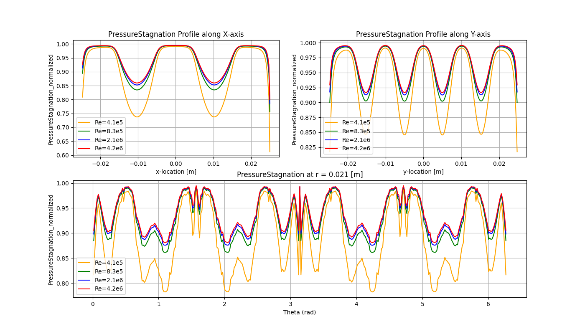

# Automated CFD Post-Processing & Headless Simulation Pipeline

[](https://www.python.org/)
[](https://docs.pyvista.org/)
[](https://scipy.org/)
[](https://www.ansys.com/)

## The Engineering Challenge (And Solution)
In high-fidelity aerodynamic studies, extracting and post-processing large 3D datasets (e.g., 11M+ cells) via traditional GUI-based tools (CFD-Post/Tecplot) is a severe bottleneck. 

This repository contains a **scalable Python infrastructure** built to completely automate the extraction, interpolation, and visualization of 21+ compressible 3D RANS simulations. By shifting from manual GUI operations to a **headless, programmatic workflow**, this pipeline drastically accelerates the CFD design cycle.

### Automation Impact
* **Scale Managed:** 21 parametric simulation cases (Mach, Reynolds, Temperature, Turbulence Intensity sweeps).
* **Data Volume:** 230+ `.cgns` files automatically parsed and processed.
* **Time Saved:** Reduced post-processing turnaround time by **70%** (from >10 hours of manual labor to <3 hours of automated, unattended execution).

---

## Pipeline Architecture

The workflow is divided into two distinct Python engines:

### 1. Headless Fluent Orchestrator (`Fluent_data_export.py`)
Instead of manually creating planes and exporting data case-by-case, this script acts as a job manager. 
* Autonomously generates `.jou` (Journal) files for batch execution.
* Launches Ansys Fluent in **Headless Mode** (`-g` flag) via Python's `subprocess`.
* Extracts multiple upstream/downstream cross-sectional planes and exports critical variables (Velocity, Mach, Stagnation Pressure) into the highly interoperable **CGNS format**.

### 2. PyVista / SciPy Processing Engine (`Post_processing_functions.py`)
CFD outputs are typically unstructured. This engine handles the heavy mathematical lifting to make the data analyzable:
* **Unstructured to Structured Mapping:** Utilizes `pyvista` to ingest CGNS files and `scipy.interpolate.griddata` to mathematically map raw CFD point-cloud data onto uniform 2D Cartesian and Polar grids.
* **Coordinate Transformations:** Automatically converts X-Y spatial data into $(r, \theta)$ coordinates to evaluate azimuthal flow distortion metrics.
* **Automated Normalization:** Dynamically extracts inlet boundary conditions to compute normalized stagnation pressure fields ($P_{norm}$) for accurate pressure-drop calculations.

---

## Automated Physics Extraction
The pipeline autonomously generates multi-axis, comparative visualizations to extract physical insights without human intervention.

### 1. Spatial Wake Distortion (Contour Tracking)
Tracks how the wake of a perforated screen shifts under different Reynolds numbers.
> 

### 2. Azimuthal Non-Uniformity (Polar Profiles)
Extracts Mach and Pressure fields at a constant radius ($r = 0.021m$) downstream to quantify flow distortion severity near duct walls.
> 
> 
> 
### 3. Axial Flow Development (Centerline Tracking)
Maps the exact location of local acceleration (Mach spikes) and subsequent recovery zones.
> 

---

## Usage & Execution

Because this pipeline is designed for HPC environments, it is executed entirely via CLI.

**1. Data Extraction (Requires Ansys Fluent path):**
```bash
python Fluent_data_export.py
```
*Note: Ensure `FLUENT_EXE` in the script points to your cluster/local Fluent binary path.*

**2. Data Interpolation & Visualization:**
```bash
python Post-processing.py
```
*Outputs are automatically categorized and saved into structured directories under `/Data-analysis_results/`.*

---

## 🛠️ Technical Stack
* **Simulation Automation:** Ansys Fluent Journaling, Headless Execution, Bash/HPC environments.
* **Data Ingestion:** PyVista (VTK back-end), `.cgns` parsing.
* **Mathematical Operations:** NumPy (Vectorization), SciPy (Linear Interpolation).
* **Visualization:** Matplotlib (Automated Subplots).
* 
